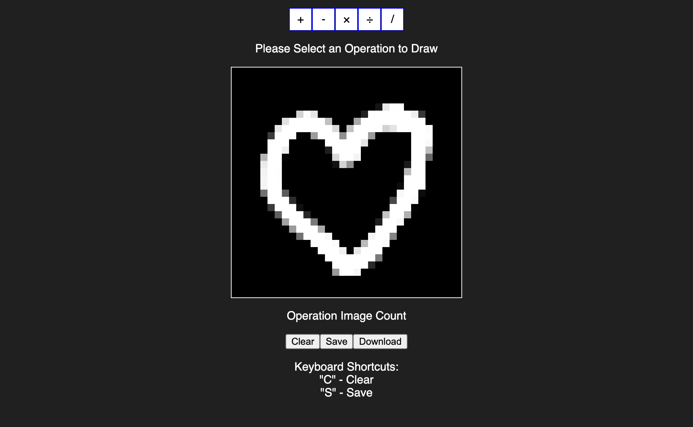

A Web App used to create 32x32 pngs of math operations.

Uses HTML Canvas to render images, and implement user drawing.

Uses Javascript libraries JSZip and FileSaver in order to export a zip of the photos.
 Exports a folder with the following format:
 &emsp;  math-operations-images
 &emsp;&emsp;      >divide
 &emsp;&emsp;&emsp;          divide0_?.png
 &emsp;&emsp;&emsp;          divide1_?.png
 &emsp;&emsp;&emsp;          divide2_?.png
 &emsp;&emsp;&emsp;          ...
 &emsp;&emsp;      >minus
 &emsp;&emsp;      >multiply
 &emsp;&emsp;      >plus
 &emsp;&emsp;      >slash
      
? - a randomly generated number between 0-100000000 to avoid naming conflicts
 An operation folder (e.g. minus, multiply, plus) is only created if there are images of them
  
Preview:

